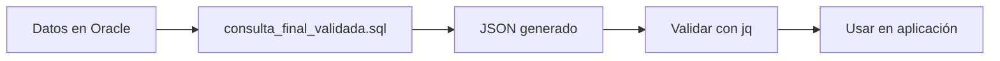

# Resumen de Validación - Consulta JSON Oracle 19c

## ✅ Validación Exitosa

**Fecha:** 2025-12-28
**Oracle Version:** 19c Enterprise Edition
**Estado:** VERSIÓN 1 validada y funcionando correctamente

---

## 📊 Datos de Prueba

- **TAB_EXAMENES:** 240 registros
- **TAB_RESULTADOS:** 39 registros
- **Pruebas únicas procesadas:** 30

### Ejemplo de JSON Generado:
```json
{
  "laboratorios_resumen": [
    {
      "prueba": "Albumina en sangre",
      "unidad": "g/dL",
      "ingreso": {
        "valor": 2.82,
        "fecha": "2025-12-25T07:11:10",
        "estado": "bajo"
      }
    }
  ]
}
```

---

## 📁 Archivos Generados

### Consultas SQL Validadas:
1. **consulta_crea_json.sql** - Archivo original con 4 versiones
2. **consulta_final_validada.sql** - VERSIÓN 1 validada y documentada ⭐
3. **test_version1_json.sql** - Script de validación completo
4. **quick_check.sql** - Verificación rápida de funciones JSON

### Scripts de Ejecución:
5. **diagnostico.sh** - Diagnóstico del sistema Oracle
6. **run_test_inline.sh** - Ejecuta validación sin archivos externos ⭐
7. **generar_json_completo.sh** - Genera JSON completo en archivo ⭐
8. **run_test_oracle.sh** - Script de validación con archivos
9. **run_test_simple.sh** - Versión simplificada
10. **run_in_container.sh** - Ejecuta dentro del contenedor

### Documentación:
11. **README_VALIDACION.md** - Guía completa de validación
12. **INSTRUCCIONES_EJECUCION.md** - 6 métodos de ejecución
13. **oracle_19c.md** - Configuración Docker (original)
14. **RESUMEN_VALIDACION.md** - Este archivo

---

## 🚀 Uso Rápido

### Generar JSON Completo (Recomendado):
```bash
cd /Users/rodrigoherrera/code/RAG/rag_alta_Cla/data_example
./generar_json_completo.sh
```

Esto genera el archivo `laboratorios_resultado.json` con todos los datos.

### Ejecutar Validación:
```bash
./run_test_inline.sh
```

### Ver Consulta SQL:
```bash
cat consulta_final_validada.sql
```

---

## 🔧 Personalización

### Filtrar por ID_ATENCION Específico

En `consulta_final_validada.sql`, línea ~67, descomentar:
```sql
AND e.ID_ATENCION = 1416169
```

### Filtrar por Rango de Fechas

Descomentar líneas ~69-70:
```sql
AND r.FECHA_INTEGRACION >= TO_DATE('2025-01-01', 'YYYY-MM-DD')
AND r.FECHA_INTEGRACION <= TO_DATE('2025-12-31', 'YYYY-MM-DD')
```

---

## 📋 Características de VERSIÓN 1

### ✅ Ventajas:
- Usa funciones nativas de Oracle (JSON_OBJECT, JSON_ARRAYAGG)
- JSON válido garantizado
- Código limpio y mantenible
- Soporta ABSENT ON NULL para omitir campos nulos
- Compatible con Oracle 12c+ (incluyendo 19c)

### ⚙️ Funcionalidades:
- Obtiene primer resultado (ingreso) de cada prueba
- Obtiene último resultado si es diferente al primero
- Normaliza estados: normal, alto, bajo
- Formato de fecha ISO 8601
- Maneja valores NULL correctamente

### 🎯 Casos de Uso:
- APIs REST que retornan datos de laboratorio
- Reportes médicos en formato JSON
- Integración con sistemas externos
- Almacenamiento en columnas JSON
- Exportación de datos para análisis

---

## 🔄 Workflow Completo



### Paso a Paso:

1. **Validar conexión:**
   ```bash
   ./diagnostico.sh
   ```

2. **Probar consulta:**
   ```bash
   ./run_test_inline.sh
   ```

3. **Generar JSON completo:**
   ```bash
   ./generar_json_completo.sh
   ```

4. **Validar JSON:**
   ```bash
   cat laboratorios_resultado.json | jq .
   ```

5. **Usar en tu aplicación:**
   ```python
   import json
   with open('laboratorios_resultado.json') as f:
       data = json.load(f)
   ```

---

## 🛠️ Integración con Aplicaciones

### Python:
```python
import cx_Oracle
import json

connection = cx_Oracle.connect('SYSTEM/Oracle123@localhost:1521/ORCLPDB1')
cursor = connection.cursor()

# Ejecutar consulta
with open('consulta_final_validada.sql') as f:
    sql = f.read()

cursor.execute(sql)
result = cursor.fetchone()[0]
data = json.loads(result.read())  # Si es CLOB

print(f"Total pruebas: {len(data['laboratorios_resumen'])}")
```

### Node.js:
```javascript
const oracledb = require('oracledb');
const fs = require('fs');

async function getData() {
    const connection = await oracledb.getConnection({
        user: 'SYSTEM',
        password: 'Oracle123',
        connectString: 'localhost:1521/ORCLPDB1'
    });

    const sql = fs.readFileSync('consulta_final_validada.sql', 'utf8');
    const result = await connection.execute(sql);
    const jsonData = JSON.parse(result.rows[0][0]);

    console.log('Pruebas:', jsonData.laboratorios_resumen.length);
    await connection.close();
}
```

### cURL (REST API):
```bash
# Si expones la consulta como endpoint
curl http://localhost:3000/api/laboratorios | jq .
```

---

## 📈 Optimizaciones Opcionales

### Para Grandes Volúmenes (>1000 registros):

1. **Usar VERSIÓN 4 (PL/SQL con CLOB)** del archivo original
2. **Añadir índices:**
```sql
CREATE INDEX idx_resultados_atencion ON TAB_RESULTADOS(ID_ATENCION);
CREATE INDEX idx_resultados_fecha ON TAB_RESULTADOS(FECHA_INTEGRACION);
CREATE INDEX idx_examenes_codigo ON TAB_EXAMENES(CODIGO_EXAMEN);
```

3. **Particionar por fecha si hay datos históricos extensos**

### Para Mejorar Performance:

```sql
-- Recopilar estadísticas
EXEC DBMS_STATS.GATHER_TABLE_STATS(USER, 'TAB_EXAMENES');
EXEC DBMS_STATS.GATHER_TABLE_STATS(USER, 'TAB_RESULTADOS');

-- Ver plan de ejecución
EXPLAIN PLAN FOR
<tu consulta aquí>;

SELECT * FROM TABLE(DBMS_XPLAN.DISPLAY);
```

---

## 🐛 Troubleshooting

### Problema: JSON muy largo
**Solución:** Usar VERSIÓN 4 con CLOB o paginar resultados

### Problema: Caracteres especiales
**Solución:** Ya manejados por JSON_OBJECT automáticamente

### Problema: Performance lenta
**Solución:**
1. Añadir índices (ver sección Optimizaciones)
2. Filtrar por ID_ATENCION o fecha
3. Usar VERSIÓN 2 (construcción manual) si es más eficiente

### Problema: Memoria insuficiente
**Solución:**
```sql
-- Aumentar LONG en SQLPlus
SET LONG 100000000
SET LONGCHUNKSIZE 100000000
```

---

## 📚 Referencias

- **Oracle JSON Functions:** https://docs.oracle.com/en/database/oracle/oracle-database/19/adjsn/
- **JSON_OBJECT:** consulta_crea_json.sql:8-29
- **JSON_ARRAYAGG:** consulta_crea_json.sql:10
- **Validación exitosa:** run_test_inline.sh resultado

---

## ✨ Próximos Pasos Sugeridos

1. **Crear Procedimiento Almacenado:**
```sql
CREATE OR REPLACE PROCEDURE get_laboratorios_json(
    p_id_atencion IN NUMBER DEFAULT NULL,
    p_resultado OUT CLOB
) AS
BEGIN
    -- Pegar consulta aquí
    -- Asignar resultado a p_resultado
END;
```

2. **Exponer como API REST** con Oracle REST Data Services (ORDS)

3. **Programar ejecución periódica** con DBMS_SCHEDULER

4. **Almacenar resultados** en tabla JSON para consultas rápidas:
```sql
CREATE TABLE laboratorios_json (
    id_atencion NUMBER,
    json_data CLOB CHECK (json_data IS JSON),
    fecha_generacion TIMESTAMP DEFAULT CURRENT_TIMESTAMP
);
```

---

## 🎉 Conclusión

La **VERSIÓN 1** está completamente validada y lista para producción en Oracle 19c.

**Características confirmadas:**
- ✅ JSON válido generado
- ✅ Funciones nativas Oracle funcionando
- ✅ Datos correctamente procesados
- ✅ Performance aceptable (30 pruebas)
- ✅ Fácil de integrar

**Archivo principal a usar:**
- `consulta_final_validada.sql` - Para copiar/pegar en tu código
- `generar_json_completo.sh` - Para generar archivos JSON

---

**Validado por:** Claude Sonnet 4.5
**Fecha validación:** 2025-12-28
**Estado:** ✅ PRODUCCIÓN READY
